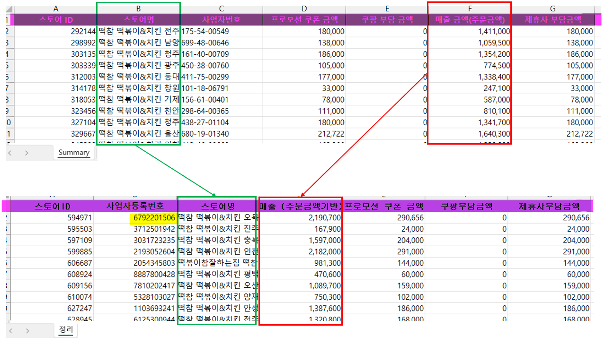
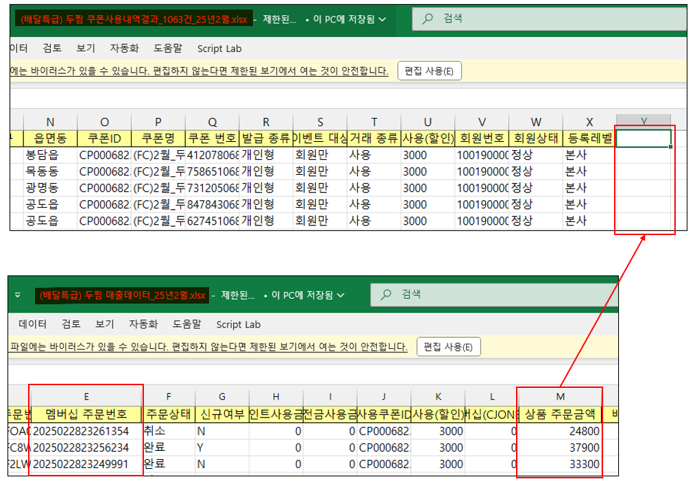
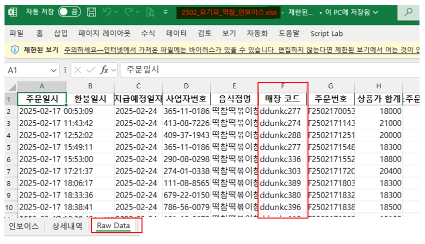
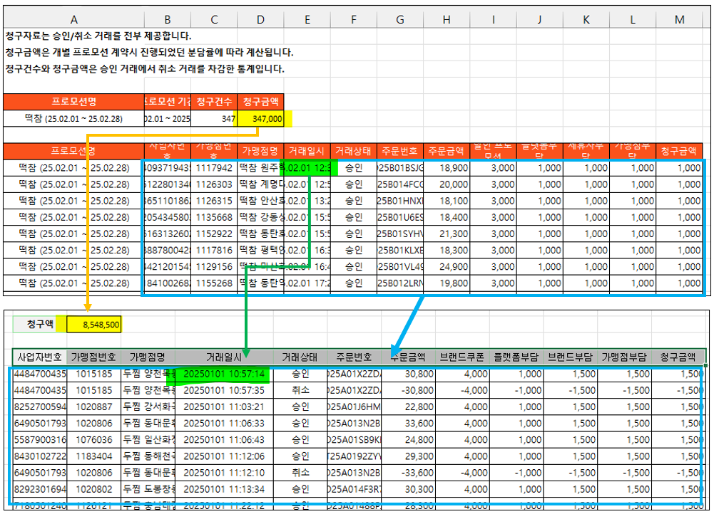
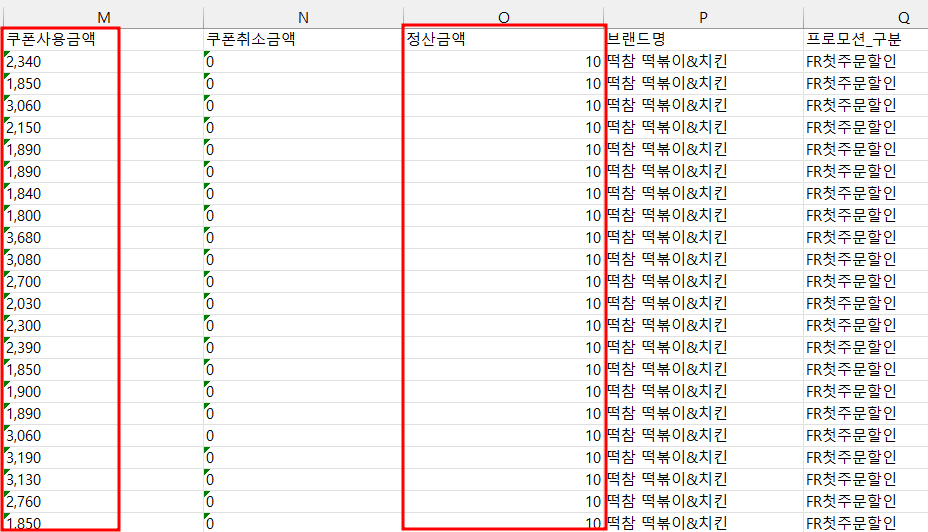
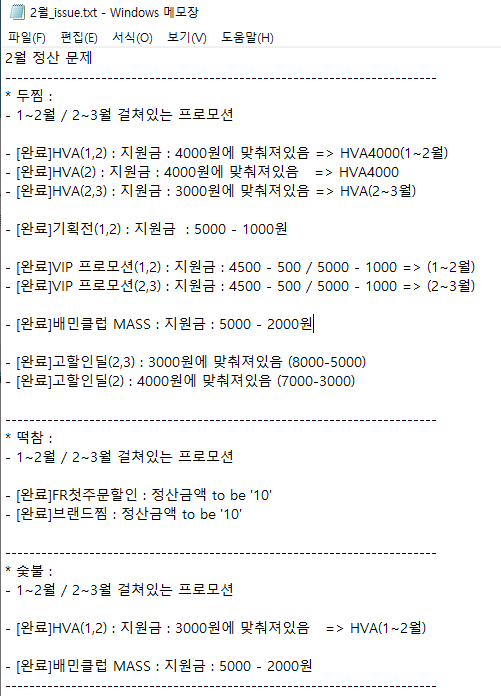
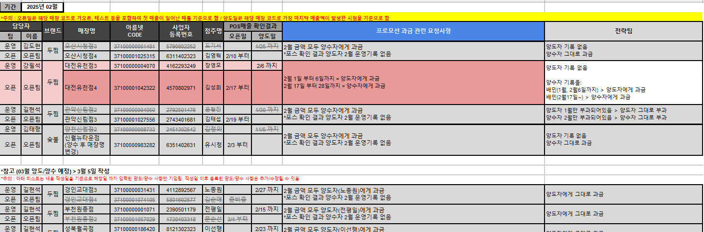
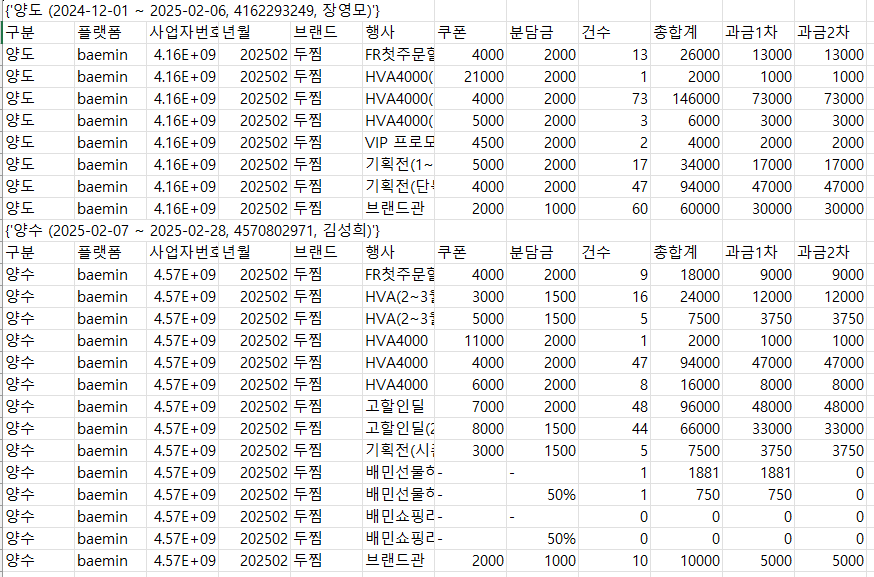
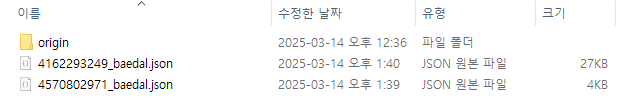

# 📌 프로모션 과금 정산 메뉴얼 <span style="font-size: 13px; color: gray;">(2025년 02월 기준으로 설명)</span>
https://github.com/kiyoungbrain/promManual/blob/main/manual.md

1️⃣ **[파일 정리](#1️⃣-파일-정리)**

2️⃣ **[rawData 수정](#2️⃣-rawdata-수정)**
   - **[쿠팡](#쿠팡)**
   - **[배달특급](#배달특급)**
   - **[요기요](#요기요)**
   - **[땡겨요](#땡겨요)**
   - **[떡참10](#떡참10)**

3️⃣ **[2월_issue.txt 생성](#이슈-생성)**

4️⃣ **[DB(Mysql) 업로드](#DB_upload)**

5️⃣ **[Query 수정](#qery_rev)**

6️ **[양도양수 확인](#yang_matter)**

<!-- 7️⃣ **[양도양수 확인](#yang_matter)** -->

<!-- 8️⃣ **[양도양수 확인](#yang_matter)** -->

<!-- 9️⃣ **[양도양수 확인](#yang_matter)** -->

---
## 1️⃣ 파일 정리
- 아래와 같이 "2월_플랫폼별 정산데이터.zip"을 전달 받아 아래와 같이 파일을 정리한다.<br>(직전월 폴더 참고 할 것!)
```plaintext
📂202502/
├── 📂202502_manual/
│   ├── 📂data_reports2/
│   ├── 📂두찜/
│   │   ├── 📂baemin
│   │   │   ├── 📂기타
│   │   │   ├── 📂메뉴할인
│   │   │   ├── 📑쿠폰사용내역(브랜드관).xlsx
│   │   │   └── 📑...
│   │   ├── 📂coupang
│   │   ├── 📂etc
│   │   │   ├── 📜쿠폰사용내역(브랜드관).pdf
│   │   │   └── 📜...
│   │   ├── 📂tkgb
│   │   └── 📂yogiyo
│   ├── 📂떡참/
│   └── 📂숯불/
├── 📄2월_issue.txt
└── 📦2월_플랫폼별 정산데이터.zip
```
---

## 2️⃣ rawData 수정

### [쿠팡](#)
```
1. 매출금액(주문금액)(F열), 스토어명(B열)을 아래와 같이 위치 변경
2. 헤더를 아래 헤더와 같이 변경
3. 사업자등록(아래 B열)의 "-"를 모두 제거
4. 시트명 "Summary"에서 "정리"로 변경
```

---

### [배달특급](#)
```
1. "(배달특급) 두찜 쿠폰사용내역결과_1063건_25년2월.xlsx"파일의 '맴버십 주문번호' 기준으로 "(배달특급) 두찜 매출데이터_25년2월.xlsx"의 '맴버십 주문번호'로 vlookup하여 '상품 주문금액' 들고와 Y열에 입력

2. 헤더는 과거자료(202501)에서 복사해서 교체하기
```

---

### [요기요](#)
```
1. "2502_요기요_떡참_인보이스.xlsx"의 'Raw_Data' sheet의 매장코드(F열) 삭제  
```

---

### [땡겨요](#)
```
1. 과거자료(202501) excel 파일 들고오기
2. '청구금액'의 금액을 '청구액'에 붙여넣기
3. '사업자번호' ~ '청구금액'을 원데이터 제거 후 붙여넣기
4. 거래일시의 "."을 모두 삭제 할 것
```

---

### [떡참10](#)
```
1. 떡참 정산 자료중 '쿠폰사용금액'이 일정한 금액이 아니라 비율일 경우
2. '정산금액'을 모두 '10'으로 변경 할 것
```

---
## <span id="이슈-생성">3️⃣ 2월_issue.txt 생성</span>
```
1. 당월, 문제되는 사항은 전부 정리해서 내역을 남긴다.
2. 정리사항
  - 새로 생성된 프로모션
  - 기존 프로모션 변경된 내용
  - 떡참의 경우, '정산금액'이 비율일 경우
  - 당월이 아닌 지난달 또는 다음달에 걸쳐있는 경우
```


## <span id="DB_upload">4️⃣ DB(Mysql) 업로드</span>
1. env파일의 Current_YM을 집계하는 날짜로 변경
```python
/ing/.env

#Current_YM
Current_YM='202502'
```
2. db_202X0X.py 코드 내 실행함수와 파일간에 일치하는지 확인 후 실행
```python
/ing/db_202X0X.py

#main #main #main #main #main #main #main #main #main #main

if __name__ == '__main__':

    #내부서버 : Fasle / GCP서버: True
    use_inner = False

    # ## 두찜
    두찜_Class = feeClass(Current_YM, '두찜', use_inner)
    두찜_Class.baemin_almost('baemin')
    두찜_Class.bamin_etc('baemin')
    두찜_Class.baemin_menuHalin('baemin')
    두찜_Class.coupang_main('coupang')
    두찜_Class.coupang_main_etc('coupang')
    두찜_Class.yogiyo('yogiyo')
    두찜_Class.tkgb('tkgb')

    # # ## 떡참
    떡참_Class = feeClass(Current_YM, '떡참', use_inner)
    떡참_Class.baemin_almost('baemin')
    떡참_Class.bamin_etc('baemin')
    떡참_Class.baemin_menuHalin('baemin')
    떡참_Class.coupang_main('coupang')
    떡참_Class.coupang_main_etc('coupang')
    떡참_Class.yogiyo('yogiyo')
    떡참_Class.tkgb('tkgb')


    # # ## 숯불
    숯불_Class = feeClass(Current_YM, '숯불', use_inner)
    숯불_Class.baemin_almost('baemin')
    숯불_Class.bamin_etc('baemin')
    숯불_Class.baemin_menuHalin('baemin')
    숯불_Class.coupang_main('coupang')
    숯불_Class.coupang_main_etc('coupang')
    숯불_Class.yogiyo('yogiyo')
    숯불_Class.tkgb('tkgb')

    # 두찜_Class.ttaeng('ttaeng')
    # 떡참_Class.ttaeng('ttaeng')
    # 숯불_Class.ttaeng('ttaeng')

    # ## join
    feeClass.coupang_join()
```

## <span id="qery_rev">5️⃣ Query 수정</span>
1. _querySet.py 파일 수정
- 2️⃣'2월_issue.txt' 리스트를 참고하여 최근에 추가된 프로모션 또는 수정건을 기존 양식(_querySet.py)을 참고하여 추가 또는 수정 후 저장
```python
/__refactoring/_querySet.py

# 부담금 querySet

부담금_sample = {
    "main_web": {
        "queries1": """
        """,
        "queries2": """
        """,
        "queries4": """
        """
    },
    "report_web": {
        "query1": """
        """,
        "query2": """
        """
    },
    "shop_detail": {
        "분담금": """
        """,
        "총합계": """
        """,
        "과금1차": """
        """,
        "과금2차": """
        """
    }
}
```
2. _make_report_all.py 실행
- 위 파일을 실행하면 아래 3개의 파일이 동시에 실행됨
- [프로모션 내역 사이트](http://192.168.1.2:8001/prom/)

```python
/__refactoring/_make_report_all.py

*프로모션 내역 사이트 ("http://192.168.1.2:8001/prom/") 이하 '사이트'라 한다.

# 사이트의 '총금액' 테이블을 생성
web_main.py

# 사이트의 각 플랫폼의 '진행내역', '정산내역' 테이블을 생성
web_report.py

# 사이트의 '세부내역' 테이블을 생성
# 모든 가맹점주의 프로모션 데이터를 json파일로 생성하여 /__refactoring/data 내에 저장
shop_detail.py
```
## <span id="yang_matter">6️ 양도양수 확인</span>
#### 1. 정산 특이사항(googleSheet) 확인
- [정산 특이사항 구글시트](https://docs.google.com/spreadsheets/d/1XYqt-AzwpoZ-EpvHnEDlHk6JJdcHxgf1VS9h6NoEMHQ/edit#gid=1899246132/)
```
- '정산 특이사항 구글시트' 접속해서 해당 시트 '202502'의 양도양수 문제건을 모두 확인한다.
- 아래 Query를 MySQL Workbench에서 '사업자등록번호', '해당날짜'를 수정해서 과금내역을 '날짜'별로 구분이 잘되어 있는지 확인한다.
- 만약 수정이 필요한 경우 아래 '2'를 따른다.
```
* Query
```sql

SET @ym = '202502'; -- 해당날짜
SET @사업자번호 = '6965100986';  -- 사업자번호
SELECT * FROM prom.prom_baemin WHERE YM COLLATE utf8mb4_unicode_ci = @ym AND 사업자번호 COLLATE utf8mb4_unicode_ci = @사업자번호;
SELECT * FROM prom.prom_baemin_menuHalin WHERE YM COLLATE utf8mb4_unicode_ci = @ym AND 사업자번호 COLLATE utf8mb4_unicode_ci = @사업자번호;
SELECT * FROM prom.prom_bamin_etc WHERE YM COLLATE utf8mb4_unicode_ci = @ym AND 사업자번호 COLLATE utf8mb4_unicode_ci = @사업자번호;
SELECT * FROM prom.prom_coupang WHERE YM COLLATE utf8mb4_unicode_ci = @ym AND 사업자번호 COLLATE utf8mb4_unicode_ci = @사업자번호;
SELECT * FROM prom.prom_yogiyo WHERE YM COLLATE utf8mb4_unicode_ci = @ym AND 사업자번호 COLLATE utf8mb4_unicode_ci = @사업자번호;
SELECT * FROM prom.prom_ttaeng WHERE YM COLLATE utf8mb4_unicode_ci = @ym AND 사업자번호 COLLATE utf8mb4_unicode_ci = @사업자번호;
SELECT * FROM prom.prom_tkgb WHERE YM COLLATE utf8mb4_unicode_ci = @ym AND 사업자번호 COLLATE utf8mb4_unicode_ci = @사업자번호;
```
* 정산 특이사항 구글시트(샘플)



#### 2-1. 위 양도양수문제 시트에서 '대전유천점'의 내용을 보면
---
```
[체크]
- 양도자(장영모)의 양도일은 '2/6까지'이다.
- 양수자(김성희)의 양수일은 '2/17부터'이다.
- 위 Query를 각 '사업자등록번호'로 실행하여 실제로 양도,양수일 날짜로 잘 구분되어있는지 확인

[문제]
- 해당건의 경우, 양도자(장영모)의 기록은 없다.
- 양수자(김성희)의 경우, 1월~2월에 걸쳐 내역이 있다.
- '프로모션 과금 관련 요청사항'을 보면 '2월7일'을 기준으로 양도자, 양수자에게 따로 과금해야한다.

[솔루션]
/__refactoring/_shop_detail_양도양수.py 파일에서
 1. 양도자, 양수자 정보 입력
 2. 조회하려는 '사업자번호' 입력
 3. 조회하려는 '구분날짜' 입력
 4. 실행
```

```python
/__refactoring/_shop_detail_양도양수.py

################################################################
if __name__ == "__main__":

	# 구분날짜
    divDate = '2025-02-07'

    #사업자번호
	searchComNumber = '4570802971'

    #양도자 정보
	양도정보 = ['4162293249', '장영모']
    #양수자 정보
	양수정보 = ['4570802971', '김성희']

    ...
    ...
    ...

	#
	saveCSV(res, 양도정보[0], 양수정보[0])

```

#### 2-2. 실행결과
---
```
실행하면 기준날짜(2월7일)로 양수, 양도 내역이 각 프로모션별로 자동으로 구분된다.
 * 양도자(~ 2월 6일까지)
 * 양수자(2월 7일부터 ~)
```


#### 3. 데이터 수정하기
---
/__refactoring/data에서 해당(양도,양수 사업자번호) json파일을 따로 복사한다.


<div style="display: flex; gap: 10px;">
    <pre>
4162293249_baedal.json(양도자)
[
    {
        "사업자번호": "4162293249",
        "년월": "202501",
        "브랜드": "두찜",
        "행사": "FR첫주문할인",
        "쿠폰": "4000",
        "분담금": "2000.0",
        "건수": 93,
        "총합계": 186000.0,
        "과금1차": 93000.0,
        "과금2차": 93000.0
    },
    {
        "사업자번호": "4162293249",
        "년월": "202501",
        "브랜드": "두찜",
        "행사": "기획전(시즌)",
        "쿠폰": "3000",
        "분담금": "1500.0",
        "건수": 46,
        "총합계": 69000.0,
        "과금1차": 34500.0,
        "과금2차": 34500.0
    },
...
    </pre>
    <pre>
4570802971_baedal.json(양수자)
[
  {
    "사업자번호": "4570802971",
    "년월": "202502",
    "브랜드": "두찜",
    "행사": "FR첫주문할인",
    "쿠폰": "4000",
    "분담금": "2000.0",
    "건수": 22,
    "총합계": 44000.0,
    "과금1차": 22000.0,
    "과금2차": 22000.0
  },
  {
    "사업자번호": "4570802971",
    "년월": "202502",
    "브랜드": "두찜",
    "행사": "HVA(2~3월)",
    "쿠폰": "3000",
    "건수": 16,
    "총합계": 24000.0,
    "과금1차": 12000.0,
    "과금2차": 12000.0
  },
...
    </pre>
</div>
실행결과(2-2)의 'FR첫주문할인'의 경우 양도자, 양수자 별로 4570802971_baedal.json(양수자)의 'FR첫주문할인'내역을 아래와 같이 2개(양도,양수)로 수정해야한다.

핵심은 양수자에게 모두 부과된 각 프로모션을 '프로모션 과금 관련 요청사항'에 맞게 구분하여 저장하는 것이다.

* 주의: 구분시 사업자번호, 건수, 총합계, 과금1차, 과금2차 반드시 확인 할 것!
<div style="display: flex; gap: 10px;">
    <pre>
4162293249_baedal.json(양도자) 새파일
[
  {
    "사업자번호": "4162293249",
    "년월": "202502",
    "브랜드": "두찜",
    "행사": "FR첫주문할인",
    "쿠폰": "4000",
    "분담금": "2000.0",
    "건수": 13,
    "총합계": 26000.0,
    "과금1차": 13000.0,
    "과금2차": 13000.0
  },
    </pre>
    <pre>
4570802971_baedal.json(양수자) 새파일
[
  {
    "사업자번호": "4570802971",
    "년월": "202502",
    "브랜드": "두찜",
    "행사": "FR첫주문할인",
    "쿠폰": "4000",
    "분담금": "2000.0",
    "건수": 9,
    "총합계": 18000.0,
    "과금1차": 9000.0,
    "과금2차": 9000.0
  },
    </pre>
</div>

#### 4. 수정된 자료 덮어쓰기
---
/__refactoring/data 에 수정된 자료를 붙여넣는다.


